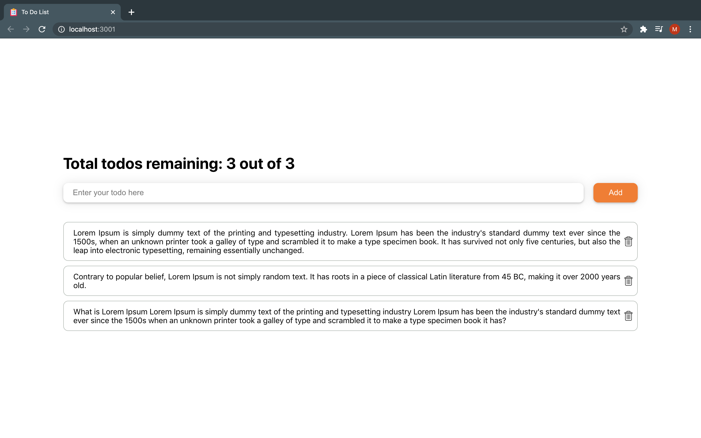

# ⌘ To do List App

This is an todo List application made with html css and typescript in react and using `create-react-app` and `typescript`. [Click here]( https://7o1zg.csb.app/ ) to see the demo.



## ⌘ Features
- This application is compatable to run on any browser and in any device special support for IE11 has be added.
- This application is responsive and can adjust to any resolution.
- This application is also accessible from keyboard for people who can not use mouse or do not want to. Keyboard Accibility guidelines are shared at the end of this document.

## ⌘ Installing
- Clone github repository https://github.com/mohitagrawal1305/todo-list-app.
- run `npm install` command after cloning project.
- run `npm start` to start the dev server.


## ⌘ Running the tests
You can run the test cases my running `npm test` command.

## ⌘ Project Structure
This document describes the top-level project structure.

```
├── images
|  └── demo.png
├── public
|  ├── favicon.png
|  └── index.html
└── src
   ├── Components
   |     ├── dashboard
   |     └── SearchBar
   ├── modules
   |     ├── button
   |     ├── choice-list
   |     └── input-field
   └── utils
        ├── cloneDeep
        └──useStore
```


### ⌘ images
This folder contains static images.

### ⌘ public
This folder contains html for this application.

### ⌘ src
This folder contains source code for this application.

#### ⇨ src/Components
   This folder contains components which use one or many reusable modules.

#### ⇨ src/modules
   This folder contains re-usable and sharable modules with are independent of any dependencies.


#### ⇨ src/utils
   This folder contains pure function and custom hook.
   
### **NOTE**
  Each module and Component contains `<module-name>.css`, `<module-name>.test.jsx`, `<module-name>.tsx` and `index.ts` files. and comments has been added on every file to get a better understanding of code.


## ⌘ Keyboard Accessibility Guide
- When application launches Input field is auto focused.
- you can start typing and press enter to add todo.
- you can navigate to different component using `tab` key and press enter to submit or select any item.

## ⌘ Future Scope of Improvement
- Can add edit feature to edit existing todo item.
- Can be integrated with server to access the application any where.
- Can add functionality to share notes to a friend.
- Can add functionality to collaborate notes with friends.
- Can add Archive feature to restore deleted todo's.